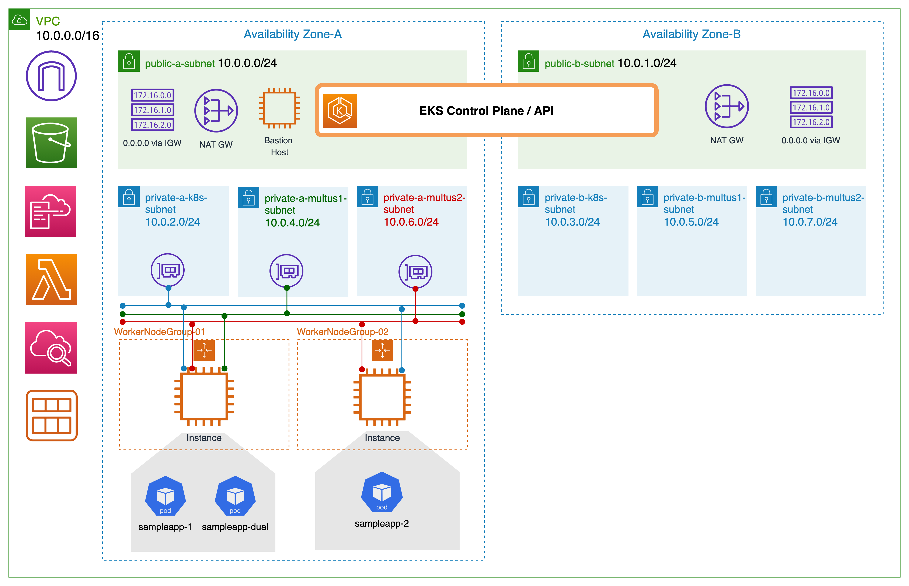

# Use-Multus-CNI-to-enable-DPDK-on-EKS

Amazon Elastic Kubernetes Service (Amazon EKS) 在2021年8月宣布支持 Multus 容器网络接口 (CNI) 插件，使客户能够附加多个网络接口并将高级网络配置应用于基于 Kubernetes 的应用程序。 凭借 Multus 的可用性，通信服务提供商和其他具有独特网络要求的客户可以配置他们的 EKS 集群来运行连接到多个接口的多宿主 Kubernetes pod。

在这篇文章中，我们将介绍 Multus CNI，涵盖适用的用例，并演练如何部署和设置 Multus CNI。 

## 什么是Multus CNI？

CNI 是容器网络接口，它提供应用程序编程接口来配置容器中的网络接口。 [Multus CNI](https://github.com/k8snetworkplumbingwg/multus-cni) 是 Kubernetes 的容器网络接口插件，可以将多个网络接口附加到 pod。 在 Kubernetes 中，除了本地环回之外，每个 pod 默认只有一个网络接口。 使用 Multus，您可以创建具有多个接口的多宿主 Pod。 Multus 充当“元”插件，可以调用其他 CNI 插件来配置其他接口。 

Pod 的多个网络接口在各种用例中都很有用； 例子包括： 
* 流量拆分：运行需要分离控制/管理和数据/用户平面网络流量以满足低延迟服务质量 (QoS) 要求的网络功能 (NF)。
* 性能：附加接口通常利用专门的硬件规范，例如单根 I/O 虚拟化 [(SR-IOV)](https://github.com/k8snetworkplumbingwg/sriov-network-device-plugin) 和数据平面开发套件 [(DPDK)](https://www.dpdk.org/)，它们绕过操作系统内核以提高带宽和网络性能。
* 安全性：支持对流量隔离要求严格的多租户网络。 将多个子网连接到 Pod 以满足合规性要求。 

## Multi-homed pod
Multus CNI 插件允许 Pod 在 Kubernetes 中拥有多个接口。对 Multus 的 EKS 支持的当前版本捆绑了 Amazon VPC CNI 作为默认委托插件（这是唯一受支持和验证的默认委托插件）。默认委托插件为 Pod 配置主网络接口 (eth0) 以启用 Kubernetes 控制平面流量，包括用于 Pod 主网络接口的 IP 地址管理 (IPAM)。

以下是多宿主 Pod 如何在 AWS 上工作的示例。下图显示了具有两个网络接口 eth0 和 net1 的两个 Pod。在这两种情况下，Amazon VPC CNI 管理 pod eth0（默认 Multus 委托）。接口 net1 由 Multus 通过 pod1 的 ipvlan CNI 插件管理，该插件处理与 k8 控制平面流量分离的用户平面（例如：语音、视频）流量。其中 pod2 net1 通过主机-设备 CNI 插件连接到主机弹性网络接口，并启用 DPDK 加速数据包处理。 

现在让我们看看如何在 Amazon EKS 集群上设置 Multus CNI。 我们将通过两个示例应用程序之间的简单 ping 测试来演示流量拆分场景。 我们将设置 ipvlan CNI 来管理 Pod 的辅助接口。 ping 测试将针对 ipvlan 插件提供并由 Multus 管理的网络执行。

在此设置中，我们使用 CloudFormation 模板来创建基础架构、EKS 集群和自我管理的节点组。 基础设施模板预配 Amazon Virtual Private Cloud (VPC)、集群和 Multus 的公有和私有子网，以及执行 EKS 操作的堡垒主机。 节点模板创建附加 ENI 的工作节点，以运行多宿主 Pod。 这两个 AWS CloudFormation 模板共同创建了以下资源： 

* 基础设施创建模板 
    - VpcCidr：将用于部署的 VPC CIDR。
    - AvailabilityZones：根据 EKS 要求至少有两个可用区。
    - PublicSubnet1/2：这些子网将托管堡垒主机以运行 kubectl 命令。 此外，这将托管 NAT-GW，为私有子网提供互联网访问。
    - PrivateSubnetAz1/2：AZ1 和 AZ2 中 EKS 控制平面的子网。
    - MultusSubnet1Az1/2：Multus 将用于在示例 Pod 中创建辅助接口的第一个子网。
    - MultusSubnet2Az1/2：Multus 将用于在示例 Pod 中创建辅助接口的第二个子网。
    - BastionInstance：我们可以从 (kubectl) 运行 EKS 集群操作的堡垒主机。
    - EksCluster：将运行示例工作负载的 EKS 集群。 
* EKS 工作节点组创建模板 
    - NodeGroup：运行示例 Pod 的工作节点组。
    - LambdaAttachCNI：Lambda 函数，用于将额外的 Multus 子网连接到工作节点。
    - EventbridgeEventRule：CloudWatch 事件规则，用于监控实例向上和向下扩展以触发 Lambda 钩子将额外的弹性网络接口 (ENI) 从 Multus 子网附加到工作程序节点组。 

